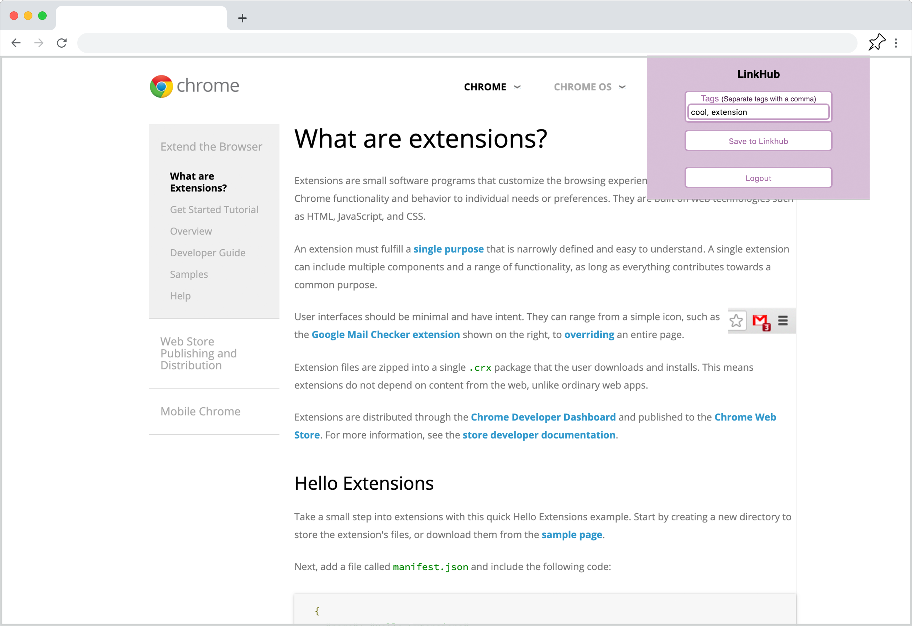
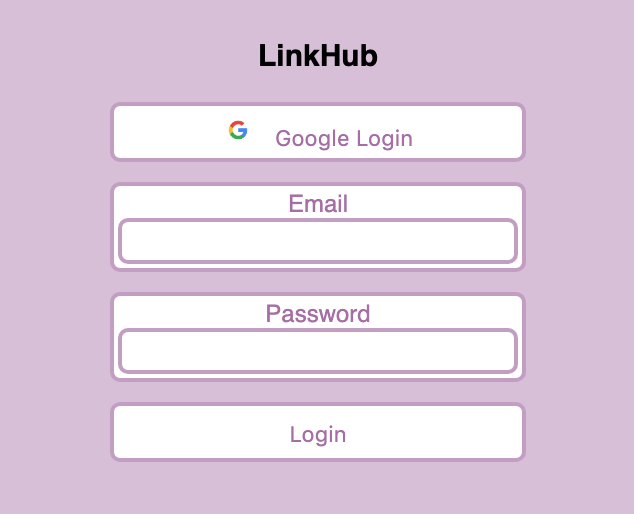
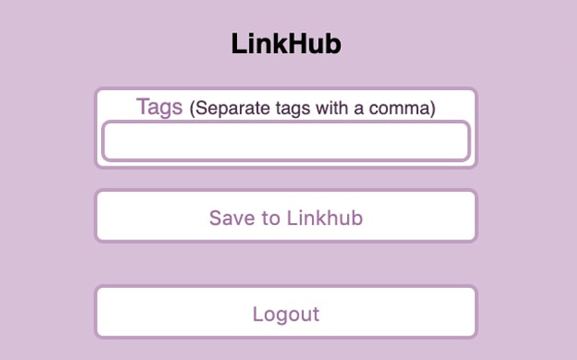

# LinkHub

Meet LinkHub! A hub for YOUR links! A website with a companion chrome extension that lets you save links from across the internet and see visually appealing previews! Tag your saved links for easy lookup later! Copy the links to your clipboard so you can share them with friends! Click on the preview image to navigate to the saved link!

Created in four days as part of Grace Hopper Stackathon. Uses React, Redux, Node.js, Express, postgreSQL, chrome API's, and other 3rd party API's

Deployed at <https://link--hub.herokuapp.com/>

Check out the companion chrome extension [here](https://github.com/hay-sam/LinkHub-extension)

